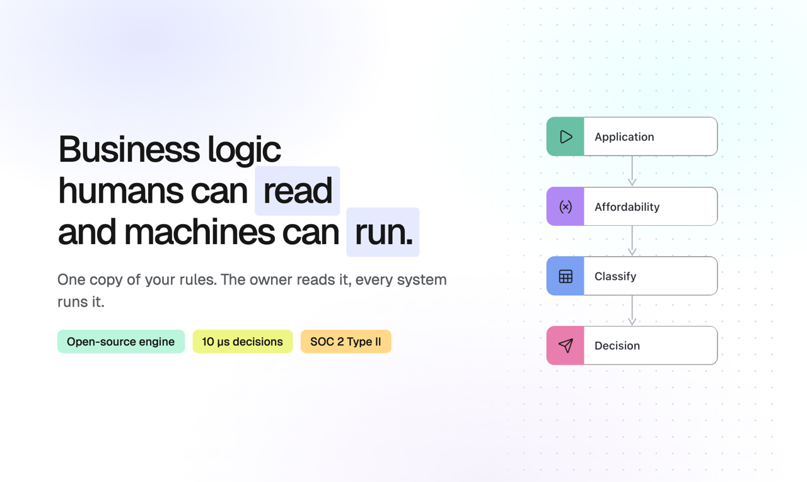
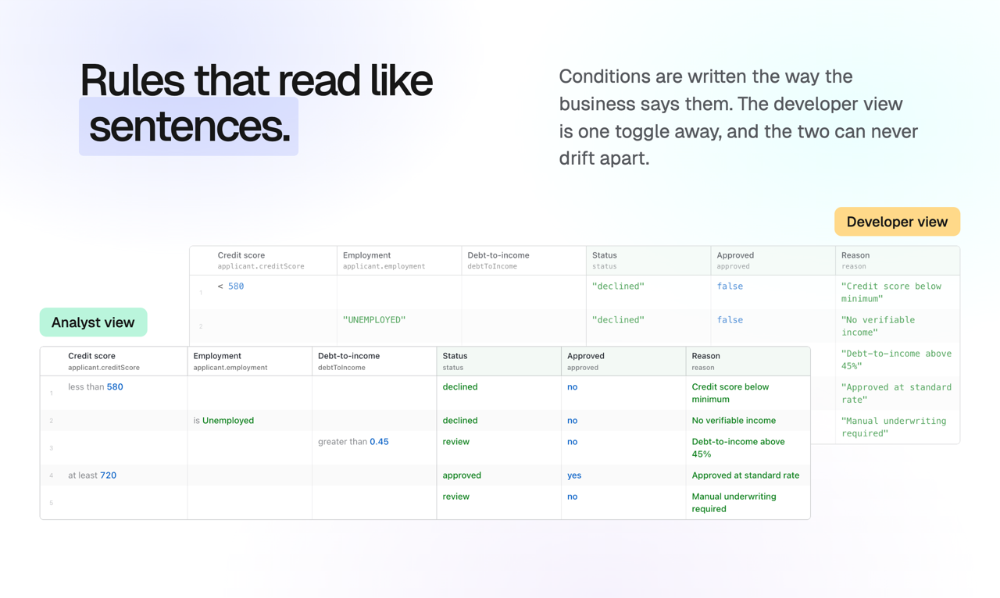
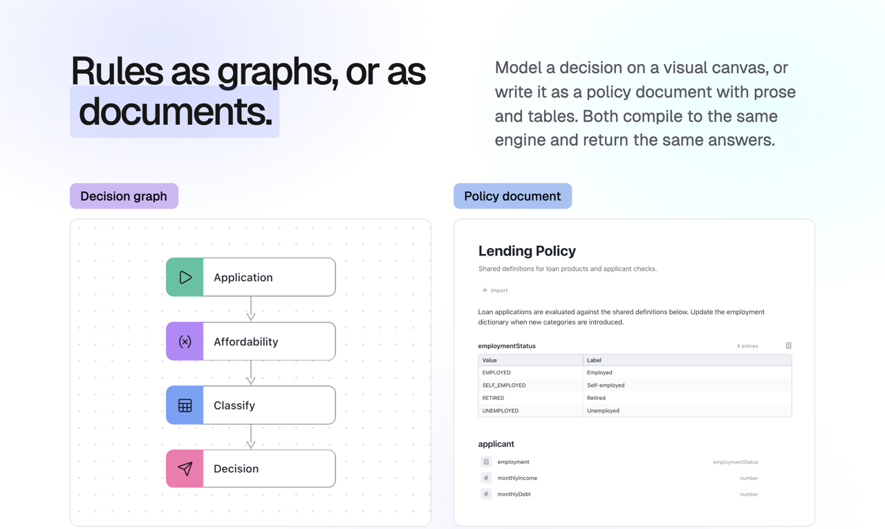
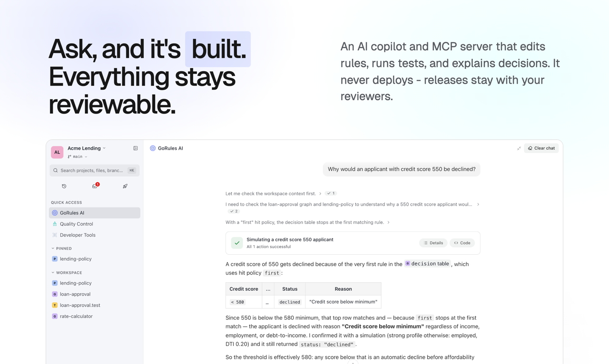
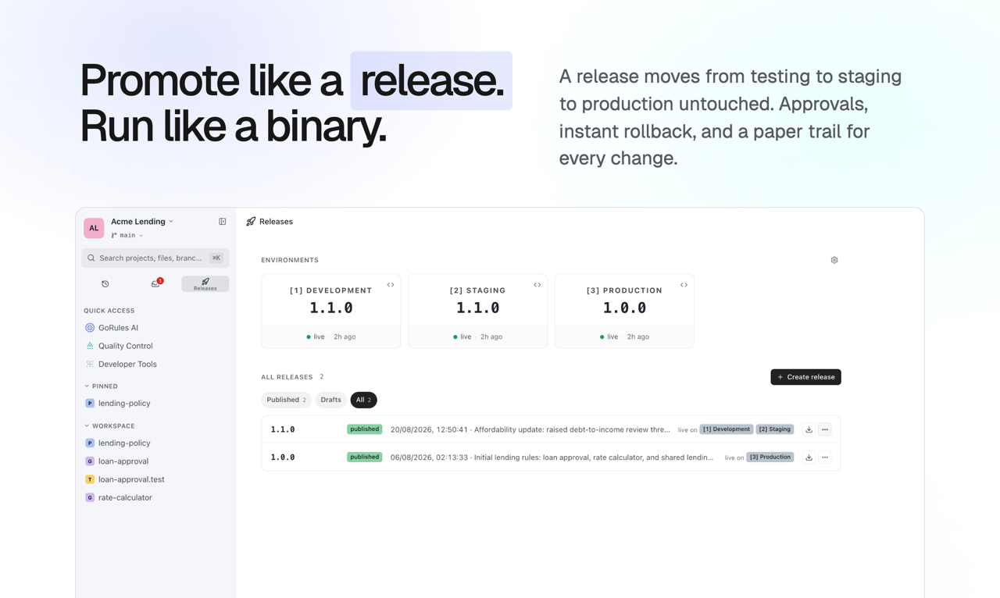
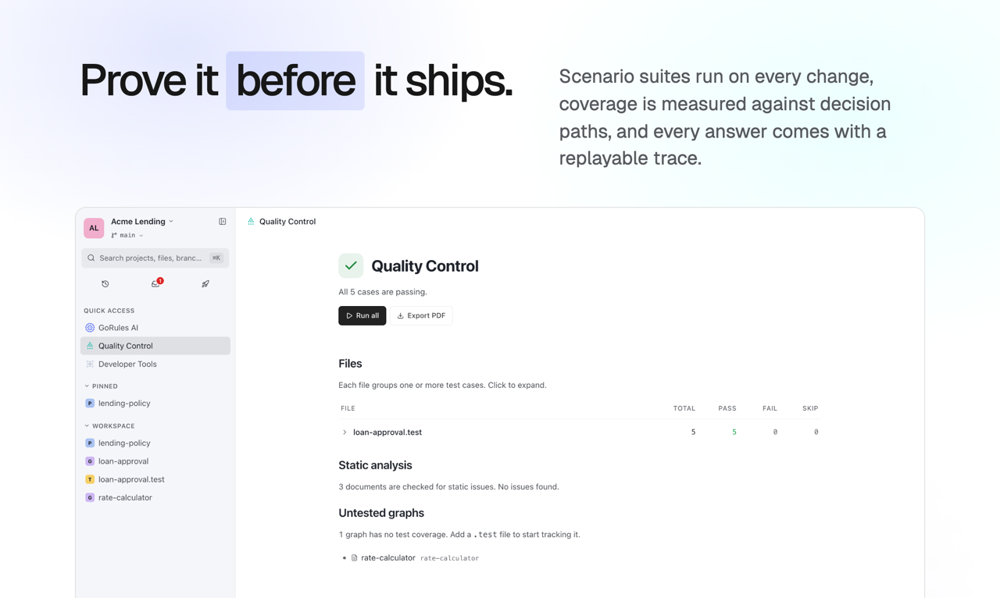

# ZEN Engine

**Business logic humans can read and machines can run.** One copy of your rules: the owner reads it, every system runs it.

[](https://opensource.org/licenses/MIT)
[](https://crates.io/crates/zen-engine)
[](https://www.npmjs.com/package/@gorules/zen-engine)
[](https://pypi.org/project/zen-engine/)



ZEN Engine is a cross-platform, open-source Business Rules Engine (BRE) written in **Rust**, with native bindings for **Node.js**, **Python**, **Go**, **Java**, **Kotlin** and **.NET**, plus iOS and Android packages. Decisions evaluate in microseconds, run identically on every platform, and are stored as portable JSON. Loading the JSON is up to you: file system, database or service call.

Try it in the free [Online Editor](https://editor.gorules.io) with a built-in simulator, or embed the open-source React [JDM Editor](https://github.com/gorules/jdm-editor) in your own product.

## Rules that read like sentences

Conditions are written the way the business says them, in the ZEN Expression Language. The developer view is one toggle away, and the two can never drift apart: there is only one source of truth, and this engine runs it.



## Rules as graphs, or as documents

Model a decision on a visual canvas of decision tables, switches, expressions, functions and reusable sub-decisions. Or write it as a policy document with prose, typed data models and tables. Both compile to the same engine and return the same answers.



To go deeper on the decision model and each node type, see the [JDM documentation](https://gorules.io/docs/rules-engine/json-decision-model) and the [ZEN Expression Language](https://gorules.io/docs/rules-engine/expression-language/) reference.

## What's new in 2.0

Version 2.0 is the first stable release of the new engine line:

- **Policy documents**: model decisions as readable documents with typed data models, expressions, decision tables, match blocks and assertions. Policies compile to the same engine as graphs and return the same answers.
- **Workspace analysis**: static type checking across policies and graphs. Type flow, exhaustiveness checking, write-conflict detection and precise diagnostics, all available before anything runs.
- **Per-column collect**: decision table output columns can collect across all matching rows (`tags[]`) while the rest of the table stays first-match.
- **Pre-compiled engine**: decisions are parsed and compiled once at load; evaluation is allocation-light and repeat-safe.
- **Hardened runtime**: out-of-range numbers, arithmetic overflow and malformed inputs return errors or nulls instead of crashing the process.
- **Unified bindings**: configurable loaders, batch evaluation and consistent error envelopes across Node.js, Python, Go and FFI consumers.

> [!IMPORTANT]
> **Migrating from 0.x (Rust crates):** `arbitrary_precision` is no longer enabled by default in zen-engine, zen-expression, zen-types and zen-tmpl. If you rely on arbitrary-precision number handling, add `features = ["arbitrary_precision"]` to your dependency. Bindings (Node.js, Python, C, UniFFI) are unaffected, they opt in automatically.

## Quickstart

### Rust

```toml
[dependencies]
zen-engine = "2"
```

```rust
use serde_json::json;
use std::sync::Arc;
use zen_engine::model::DecisionContent;
use zen_engine::DecisionEngine;

async fn evaluate() {
    let decision_content: DecisionContent =
        serde_json::from_str(include_str!("jdm_graph.json")).unwrap();
    let engine = DecisionEngine::default();
    let decision = engine.create_decision(Arc::new(decision_content)).unwrap();

    let result = decision.evaluate(json!({ "input": 12 }).into()).await;
}
```

### Node.js

```bash
npm i @gorules/zen-engine
```

```typescript
import { ZenEngine } from '@gorules/zen-engine';
import fs from 'fs/promises';

const content = await fs.readFile('./jdm_graph.json');
const engine = new ZenEngine();

const decision = engine.createDecision(content);
const result = await decision.evaluate({ input: 15 });
```

### Python

```bash
pip install zen-engine
```

```python
import zen

with open("./jdm_graph.json", "r") as f:
    content = f.read()

engine = zen.ZenEngine()

decision = engine.create_decision(content)
result = decision.evaluate({"input": 15})
```

Full guides, including loaders for multi-decision graphs and batch evaluation:

* **Node.js** - [GitHub](https://github.com/gorules/zen/blob/master/bindings/nodejs/README.md) | [Documentation](https://gorules.io/docs/developers/bre/engines/nodejs) | [npmjs](https://www.npmjs.com/package/@gorules/zen-engine)
* **Python** - [GitHub](https://github.com/gorules/zen/blob/master/bindings/python/README.md) | [Documentation](https://gorules.io/docs/developers/bre/engines/python) | [pypi](https://pypi.org/project/zen-engine/)
* **Go** - [GitHub](https://github.com/gorules/zen-go) | [Documentation](https://gorules.io/docs/developers/bre/engines/go)
* **Java / Kotlin** - [GitHub](https://github.com/gorules/zen/blob/master/bindings/uniffi) | [Maven Central](https://mvnrepository.com/artifact/io.gorules/zen-engine)
* **.NET** - [GitHub](https://github.com/gorules/zen/blob/master/bindings/uniffi) | [NuGet](https://www.nuget.org/packages/GoRules.ZenEngine)
* **Rust (Core)** - [GitHub](https://github.com/gorules/zen) | [Documentation](https://gorules.io/docs/developers/bre/engines/rust) | [crates.io](https://crates.io/crates/zen-engine)

## The GoRules platform

The engine is open at the core; [GoRules](https://gorules.io) is the platform around it. Managed cloud, self-hosted, or embedded with no network hop. SOC 2 Type II.

### AI that builds rules, and stays reviewable

An AI copilot and MCP server that edits rules, runs tests and explains decisions. It never deploys. Releases stay with your reviewers.



### Promote like a release, run like a binary

A release moves from testing to staging to production untouched. Approvals, instant rollback, and a paper trail for every change.



### Prove it before it ships

Scenario suites run on every change, coverage is measured against decision paths, and every answer comes with a replayable trace.



## Support matrix

| Arch             | Rust               | Node.js            | Python             | Go                 | Java / Kotlin      | .NET               |
|:-----------------|:-------------------|:-------------------|:-------------------|:-------------------|:-------------------|:-------------------|
| linux-x64-gnu    | :heavy_check_mark: | :heavy_check_mark: | :heavy_check_mark: | :heavy_check_mark: | :heavy_check_mark: | :heavy_check_mark: |
| linux-arm64-gnu  | :heavy_check_mark: | :heavy_check_mark: | :heavy_check_mark: | :heavy_check_mark: | :heavy_check_mark: | :heavy_check_mark: |
| darwin-x64       | :heavy_check_mark: | :heavy_check_mark: | :heavy_check_mark: | :heavy_check_mark: | :heavy_check_mark: | :heavy_check_mark: |
| darwin-arm64     | :heavy_check_mark: | :heavy_check_mark: | :heavy_check_mark: | :heavy_check_mark: | :heavy_check_mark: | :heavy_check_mark: |
| win32-x64-msvc   | :heavy_check_mark: | :heavy_check_mark: | :heavy_check_mark: | :heavy_check_mark: | :heavy_check_mark: | :heavy_check_mark: |
| linux-x64-musl   | :heavy_check_mark: | :heavy_check_mark: | :x:                | :x:                | :x:                | :x:                |
| linux-arm64-musl | :heavy_check_mark: | :heavy_check_mark: | :x:                | :x:                | :x:                | :x:                |
| linux-s390x      | :heavy_check_mark: | :x:                | :x:                | :x:                | :heavy_check_mark: | :x:                |
| wasm32 (WASI)    | :heavy_check_mark: | :heavy_check_mark: | :x:                | :x:                | :x:                | :x:                |

Mobile: **Swift (iOS XCFramework)** and **Android (AAR)** packages are published from the same core via UniFFI.

## Contribution

The JDM standard is growing and we need to keep tight control over its development and roadmap, as a number of companies use GoRules ZEN Engine and GoRules BRMS. For this reason we can't accept code contributions at this moment, apart from help with documentation and additional tests.

## License

[MIT License](https://opensource.org/licenses/MIT)
